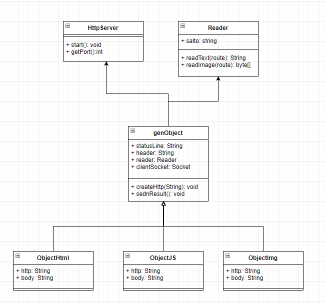
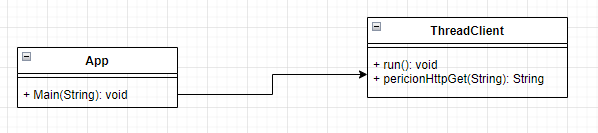

# TAREA 4 ARSW 

Escriba un servidor web que soporte multiples solicitudes seguidas (no concurrentes). El servidor debe retornar todos los archivos solicitados, incluyendo
paginas html e imagenes.
# LOC/h. Rendimiento

1. desde las 1:00 PM, hasta las 2:30 pm - fueron en total 10 lineas
2. desde las 4:00 pm, hasta las 4:55 pm - fueron en total 43 lineas


LOC = (134L/2.5h)

## 53.6 LOC

## Link de acceso https://gentle-tor-62831.herokuapp.com/

# Documentación

La documentacion de este proyecto esta en la siguiente ruta del proyecto:
```
raiz /README.md
```
## EMPEZAR

Copie el proyecto via git clone en cualquier diretorio para empezar a trabajar:
```
Falta crear repositorio
git clone https://github.com/MatiwsxD/arsw-i-Lab03.git
```

### Prerequisitos

Tener instalado Java jdk versiones 7+, Maven comandos y git

### Instalando

1. Ejecutar en terminal:

### Link de heroku: https://gentle-tor-62831.herokuapp.com/

```
$$ mvn clean install
```
2.(opcional):
si requiere la documentacion del codigo ejecute y estara en raiz /target:

```
mvn javadoc:javadoc
```

2. (Demostracion):
   En la carpeta client tiene un archivo llamado App, ese archivo se encarga de crear y ejecutar los Hilos que hacen llamadas al servidor montado en Heroku. Para ejecutarlo escriba el siguiente comando:

```
java -cp ".\target\classes" edu.escuelaing.arsw.Client.App 

```
3. Para que el cliente obtenga imagenes cambie el atributo url de ThreadClient:
```
   https://gentle-tor-62831.herokuapp.com/ImgPrueba.jpg";
```
4. Para que el cliente obtenga html cambie el atributo url de ThreadClient

```
   https://gentle-tor-62831.herokuapp.com/resultado.html";
```

5. PPara que el cliente obtenga JavaScript cambie el atributo url de ThreadClient

```
   https://gentle-tor-62831.herokuapp.com/File.js";
```

6. Diagrama de clases del servidor
   
7. Diagrama de clases del cliente
   


## Built con

* [Maven](https://maven.apache.org/) - Dependency Management
* [JAVA JDK 8](http://www.oracle.com/technetwork/java/javase/overview/index.html) - construcción


## Autor

* **Juan Mateo Mejia Zuluaga** - *Initial work* - [MatiwsxD](https://github.com/MatiwsxD)


## Licencia

This project is licensed under the GNU General Public License - see the [LICENSE](LICENSE) file for details
